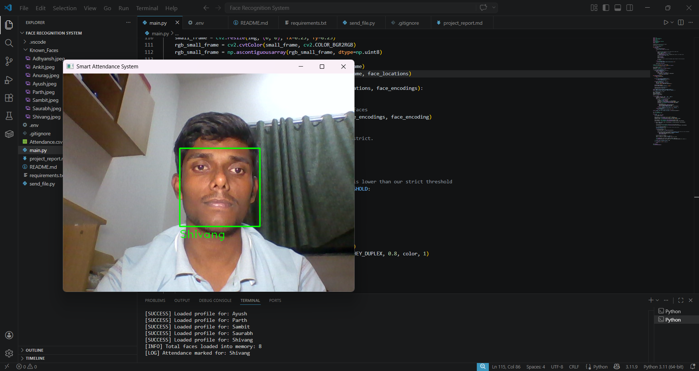
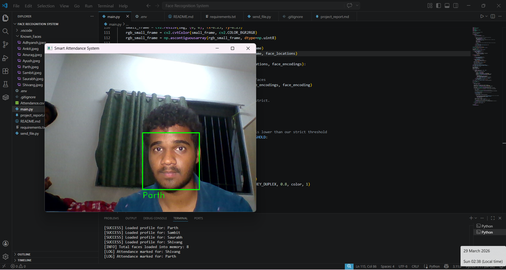
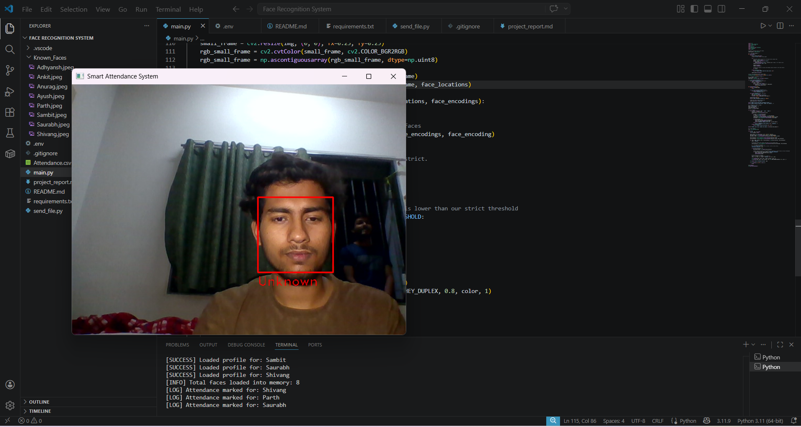

# 📷 System Output & Testing Results

This document demonstrates the real-time behavior of the Smart Attendance System during live testing. The system utilizes dynamic visual feedback (bounding boxes and text labels) to indicate recognition status.

---

## ✅ Known Faces (Successful Recognition)
When an individual is successfully matched against the encoded faces in the `Known_Faces` directory, the system provides the following feedback:
* **Visual Marker:** A **Green** bounding box is drawn around the face.
* **Identifier:** The person's registered name is displayed below the bounding box.
* **System Action:** The attendance is successfully logged in the terminal and written to the `Attendance.csv` file. An auditory "Thank You" greeting is triggered.

**Tested & Verified Profiles:**

### 1. Shivang (Accuracy: High | Status: Logged)

### 2. Parth (Accuracy: High | Status: Logged)

---

## ❌ Unknown Faces (Unregistered / Rejected)
When the system detects a face that either does not exist in the database or fails to pass the strict mathematical distance threshold (`0.48`), it aggressively rejects the match to prevent false attendance logging.

* **Visual Marker:** A **Red** bounding box is drawn around the face.
* **Identifier:** The label **"Unknown"** is displayed below the bounding box.
* **System Action:** The face is tracked on screen, but **no attendance is logged**, and no voice prompt is triggered.

**Tested & Verified Rejections:**

### 3. Unregistered Individual (Status: Successfully Rejected / Not Logged)

---
*Note: The system operates in real-time at approximately 15-30 FPS depending on hardware, with background threads handling audio queues to prevent camera stutter.*